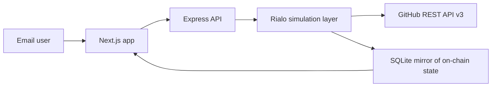

# ChainTask - On-Chain Bounty Hub for Open Source

Built on Rialo to demonstrate what becomes possible when a blockchain is natively connected to the real world.

## The Problem

On Ethereum or Solana, paying a contributor when their PR merges usually requires:

- A Chainlink oracle: external trust, 30-90s delay, and token costs.
- A Gelato keeper bot: external dependency that can fail.
- An off-chain cron job: centralized infrastructure that you maintain.

## The Rialo Solution

On Rialo, the smart contract calls GitHub directly. No middleware. No trust assumptions. When the PR merges, the contract sees it on the next reactive check and releases payment atomically.

ChainTask ships with a Node.js simulation layer because Rialo is still in private devnet. The simulation boundary is intentionally narrow: replace `apps/api/src/rialo` with public-devnet contract calls and keep the frontend/API contract intact.

## Rialo Primitives Demonstrated

### 1. Native HTTPS Connectivity

```rust
let response = rialo::https::get(&url)
    .header("Accept", "application/vnd.github.v3+json")
    .send()
    .await?;
```

This replaces oracle setup, relayer deployment, token balance management, and long oracle round delays. In the local demo, `apps/api/src/rialo/githubPoller.ts` calls the same GitHub REST API endpoint the contract would call natively.

### 2. Reactive Transactions

```rust
rialo::reactive::every(10, || async {
    let result = github_check::check_pr_merged(&repo_owner, &repo_name, pr_number).await?;
    if result.merged {
        escrow::release_funds(bounty_id, assignee).await?;
        rialo::reactive::stop();
    }
    Ok(())
}).await?;
```

The contract registers itself to check the PR every N blocks. No keeper bot. No off-chain cron. The chain itself runs the logic.

### 3. Real-World Identity

Users sign up with email. A wallet address is automatically derived. No seed phrase. No MetaMask. This is how crypto should feel for normal developer workflows.

### 4. Escrow PDA

Funds move into a contract-owned escrow address when a bounty is posted. The only release path is the contract logic that verifies the linked PR is merged.

## Architecture



On Rialo devnet, the API simulation layer becomes a small contract client that submits instructions and reads Solana-VM account state.

## Running Locally

Install prerequisites:

- Node.js 20+
- pnpm 9+
- Rust/Cargo, if you want to compile the contract

Then run:

```bash
cd chaintask
pnpm install
pnpm seed
pnpm dev
```

The web app runs at `http://localhost:3000`.
The API runs at `http://localhost:3001`.

## Free Deployment

Use Vercel Hobby for the web app and Render Free for the API.

Render can deploy the API from `render.yaml` at the repo root. After the API is live, set this Vercel environment variable for the web project:

```bash
NEXT_PUBLIC_API_URL=https://your-render-api-url.onrender.com
```

Render Free services can spin down after inactivity, so the first API request after a quiet period can take a little while. That is fine for a demo, but the reactive polling loop only runs while the service is awake.

Optional GitHub API rate-limit boost:

```bash
# apps/api/.env
GITHUB_TOKEN=your_github_token
```

## Demo Flow

1. Open `http://localhost:3000`.
2. Sign up with an email address and get a simulated Rialo wallet.
3. Open `Bounties -> Post`, enter `vercel/next.js`, choose issue `1`, and validate.
4. Lock a bounty amount into escrow and note the simulated transaction hash.
5. Sign up as a contributor in the detail page or dashboard.
6. Claim the bounty with a PR number.
7. Watch the Rialo Reactive Execution Log poll GitHub every 15 seconds.
8. Use `Verify` for a live manual poll during a short demo.

## API Surface

- `GET /api/health`
- `GET /api/bounties`
- `GET /api/bounties/:id`
- `POST /api/bounties`
- `PATCH /api/bounties/:id/claim`
- `GET /api/bounties/:id/status`
- `POST /api/bounties/:id/verify`
- `DELETE /api/bounties/:id`
- `POST /api/auth/signup`
- `POST /api/auth/login`
- `GET /api/users/:id`
- `GET /api/poll-log/:bountyId`

All errors use:

```json
{ "error": "description", "rialo_context": "what this maps to on-chain" }
```

## Expansion Roadmap

- v2: Milestone payments with multiple GitHub triggers per bounty.
- v3: On-chain reputation scores tied to email identity.
- v4: Dispute resolution with time-locked arbitration.
- v5: Private bounties using Rialo confidential computing.
